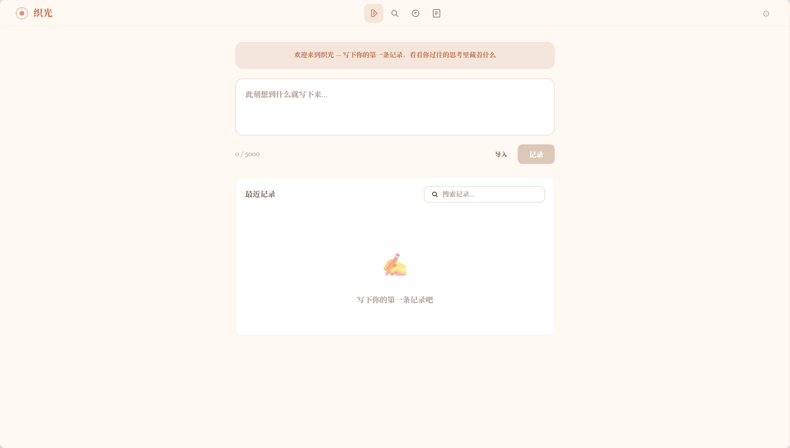

# 织光 LightWeave — 个人 AI 认知伴侣

> 你只管记，它帮你发现"原来我是这样的"。

织光是一个纯浏览器端的个人 AI 认知伴侣。写下你的复盘、日记、思考随笔，AI 自动发现历史记录间的语义关联，帮你从散落记录中看见自己的模式、矛盾、成长，最终孵化出属于自己的方法论（SOP）。

**[在线体验](https://rqran5201-stack.github.io/lightweave/)** | **[国内加速](http://121.40.113.87/)**



## 和笔记工具有什么不同

- **不是笔记工具**，不是聊天机器人——是一个安安静静陪你、偶尔轻声说两句话的朋友
- **别人用 AI 替你干活，织光用 AI 帮你看清自己**
- **所有数据只存浏览器 IndexedDB**，数据不出设备——不是"承诺不偷看"，是技术上就看不了

## 三引擎认知系统

| 引擎 | 触发时机 | 产出 |
|------|---------|------|
| 关联引擎 | 每次保存记录 | 与历史记录的语义关联 + 类别 + 置信度 |
| 问答引擎 | 用户主动提问 | 基于全部记录的流式回答 + 原文引用 |
| 孵化引擎 | 用户点「生成SOP」 | 3-7 步个人方法论 + 来源追溯 |

三个引擎共享 **Transformers.js 浏览器端 embedding**（bge-small-zh-v1.5）+ 余弦相似度全局语义检索。

## 功能全景

- **记录系统**：新建 / 编辑 / 删除 / 搜索 / 标签筛选
- **多格式导入**：文件拖拽（.txt / .md / .json / .docx / .pdf）+ 文字粘贴（3 种拆分方式）
- **关联分析**：保存即触发语义关联 + 详情页懒加载 + 外部知识来源推荐
- **双向链接**：正向关联卡片 + 反向引用
- **流式问答**：基于语义搜索上下文的 AI 对话 + 话题折叠 + 建议问题
- **SOP 孵化**：一键从问答生成个人方法论 + 去重检测 + SOP 版本合并
- **周度洞察**：AI 生成关键词 / 情绪趋势 / 亮点关联
- **导出**：MD / TXT / PDF / PNG 卡片，可筛选内容范围
- **数据备份**：JSON 明文导出/恢复 + AES-256-GCM 加密备份
- **多模型支持**：免费内置模型（Cloudflare Worker 中转）+ DeepSeek / OpenAI / Ollama 自有 Key

## 技术架构

```
React 19（纯前端 SPA，Vite 构建）
  ├── IndexedDB（6 个 Object Stores，idb 封装）
  ├── Transformers.js + bge-small-zh-v1.5（浏览器端 embedding，512维）
  ├── DeepSeek API（付费模型，fetch 直连，SSE 流式）
  ├── Cloudflare Worker（免费模型中转，Qwen3 30B / Llama 3.1 8B / DeepSeek R1）
  ├── mammoth + pdfjs-dist（.docx / .pdf 动态导入，代码分割）
  ├── Web Crypto API（AES-256-GCM 加密备份）
  ├── Canvas API + jsPDF（PNG 卡片 + PDF 导出）
  └── GitHub Pages / Nginx 静态托管
```

## 快速开始

```bash
npm install
npm run dev        # 本地开发 → http://localhost:5173
npm run build      # 生产构建 → dist/
```

首次打开自动下载 embedding 模型（~30MB，浏览器缓存）。免费模型（Qwen3 30B）开箱即用，无需配置 API Key。也可以在设置中切换 DeepSeek / OpenAI 等你自己的 Key。

### 部署免费模型代理（可选）

不部署代理也能用——在设置中填入你自己的 DeepSeek API Key 即可。部署代理后用户无需 Key：

```bash
cd worker
npm install
npx wrangler deploy
```

将获得的 `https://xxx.workers.dev/v1` 填入前端设置页的"代理地址"。

## 项目结构

```
src/
├── main.jsx / App.jsx / index.css    # 入口、路由、样式
├── pages/                             # 7 个页面
│   ├── RecordHome.jsx                 # 首页（输入+关联+列表）
│   ├── RecordDetail.jsx               # 详情（全文+关联卡片+反向引用）
│   ├── Discovery.jsx                  # 发现页（最近关联+周度洞察）
│   ├── QAPage.jsx                     # 流式问答+生成SOP
│   ├── SOPList.jsx / SOPDetail.jsx    # SOP 库+详情
│   └── GuidePage.jsx                  # 首次引导（3步）
├── components/                        # 5 个通用组件
├── api/                               # 6 个服务模块
│   ├── deepseek.js                    # LLM 调用（5 个 prompt 模板）
│   ├── embedding.js                   # 浏览器端嵌入+余弦相似度
│   ├── models.js                      # 模型目录
│   ├── import.js                      # 多格式文件解析
│   ├── backup.js                      # 备份/恢复
│   ├── crypto.js                      # AES-256-GCM 加密
│   └── export-card.js                 # PNG 卡片+PDF 导出
└── store/
    └── db.js                          # IndexedDB 6 个 object store
```

## 版本演进

详见 [CHANGELOG.md](./CHANGELOG.md)

## 许可证

MIT © 2026 王依然 (Yiran Wang)
